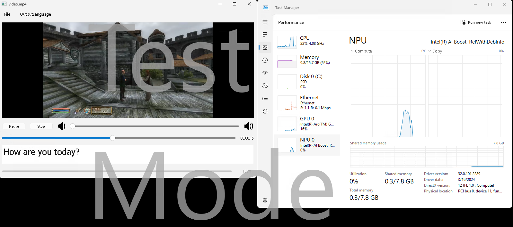

# Intel NPU - vlc player with generated subtitles by OpenAI-Whisper  

A python vlc player that transcribes subtitles while watching a video. The model used to automatically generate the subtitles is [Whisper, by Open-AI](https://openai.com/index/whisper). The default model version is the `tiny` one, for low memory impact, which doesn't have a translation capability, so the subtitle translations are done using the `google-trans` package. 
The Whisper model is compiled using the [Intel® NPU Acceleration Library](https://github.com/intel/intel-npu-acceleration-library), so that it ultimately runs on the Intel NPU, releaving the CPU or GPU of the processing for a low-powered and efficient inference.

## Content

`./src` : source files of the application

`./media` : various media files used by the project, including a test video file

## Prerequisites

For the application to run properly, install the following prerequisites:
- the [VLC](https://www.videolan.org/) media player, as the python package is just an API
- the [FFmpeg](https://ffmpeg.org/) suite for proper handling of video and audio files.

## Installation
The video player runs on the [python3](https://www.python.org/downloads/) programming language. Testing was done on version 3.10.11.

Package requirements:
```bash
googletrans==3.0.0
PyQt6==6.6.1
torch==1.11.0
intel_npu_acceleration_library==1.0.0
openai-whisper==20231117
python-vlc==3.0.20123
```

Install:
```bash
pip install -r /src/requirements.txt
```

## Usage

The app GUI can be started by running the `main.py` file:

```bash
python src/main.py
```

#### Optional Arguments
```bash
options:
  --model {tiny,base,small,medium,large}
                        Whisper-AI model version
  --in_lan {af,sq,am,ar,hy,az,eu,be,bn,bs,bg,ca,ceb,ny,zh-cn,zh-tw,co,hr,cs,da,nl,en...} , default=en
                        Input lanuage of media file
  --out_lan {af,sq,am,ar,hy,az,eu,be,bn,bs,bg,ca,ceb,ny,zh-cn,zh-tw,co,hr,cs,da,nl,en...}, default=en
                        Output language for subtitles
  --gen_sub_file True/False, default=False
                        Generates a subtitle file
```

For the model version, keep in mind the various resources needed for running:
Source:   [openai-whisper pip package](https://pypi.org/project/openai-whisper/)
| Size   |	Parameters |   model  | Required VRAM | Relative speed |
| ------ | ----------- | -------- | ------------- | -------------- |
| tiny   |	39 M       |   tiny   |	~1 GB         |	~32x           |
| base   |	74 M       |   base   |	~1 GB         |	~16x           |
| small  | 	244 M      |   small  | ~2 GB         |	~6x            |
| medium |	769 M      |   medium | ~5 GB         |	~2x            |
| large  |	1550 M     |   large  | ~10 GB        | 1x             |

#### Usage example

